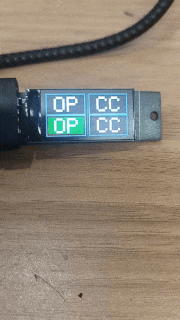

# vibe code 红绿灯

**中文** | [English](README.en.md)

基于 1.47 寸串口显示屏（160x80）的红绿灯状态服务。 淘宝搜索店铺 【墨砺工作室】

中间一条竖线分成左右两个区域，每侧上红下绿两个长方形"灯"，灯内常显字母标签。

- **左**侧灯内显示 **OP** —— 代表 **OpenCode**
- **右**侧灯内显示 **CC** —— 代表 **Claude Code**

规则：同一区域内红绿互斥（红灯亮则绿灯灭，反之亦然），左右两个区域相互独立。

效果：



## 屏幕布局示意

```
┌──────────────────────────────────────────────┬──────────────────────────────────────────────┐
│                                             │                                              │
│   ┌──────────────────────────────────┐      │      ┌──────────────────────────────────┐      │
│   │  OP                    （红）    │      │      │  CC                    （红）    │      │
│   └──────────────────────────────────┘      │      └──────────────────────────────────┘      │
│   ┌──────────────────────────────────┐      │      ┌──────────────────────────────────┐      │
│   │  OP                    （绿）    │      │      │  CC                    （绿）    │      │
│   └──────────────────────────────────┘      │      └──────────────────────────────────┘      │
│                                             │                                              │
└──────────────────────────────────────────────┴──────────────────────────────────────────────┘
```

- 灰色空心长方形为灯座，**常显**
- 灯内白色字母（左侧 OP / 右侧 CC）**常显**
- 点亮时内部填充红色或深绿色

## 运行

```bash
# 依赖
pip install -r requirements.txt          # flask, pyserial

# 真实设备模式（自动检测并连接 MSU2 串口）
python http_server.py

# 模拟模式（无需硬件，便于联调/测试）
LED_SIMULATE=1 python http_server.py
```

监听地址与端口可用环境变量覆盖：`LED_HOST`（默认 `0.0.0.0`）、`LED_PORT`（默认 `15000`）。

## 对外 API

| 方法 | 路径 | 说明 |
|------|------|------|
| GET | `/led/left/green/on` | 左绿亮（左红自动灭） |
| GET | `/led/left/red/on` | 左红亮（左绿自动灭） |
| GET | `/led/right/red/on` | 右红亮（右绿自动灭） |
| GET | `/led/right/green/on` | 右绿亮（右红自动灭） |
| GET | `/led/all/off` | 左右全部熄灭 |
| GET | `/status` | 查询左右当前状态 |
| GET | `/health` | 健康检查 |

所有接口均返回 JSON。下面每个命令附带真实返回与屏幕效果。

> 说明：curl 在终端实际返回的是 `\uXXXX` 形式的 Unicode 转义，下文中为便于阅读已展示为对应中文。

### 左绿亮

```bash
curl http://127.0.0.1:15000/led/left/green/on
```

返回：

```json
{"left":{"green":true,"red":false},"message":"左侧绿灯已点亮","right":{"green":false,"red":true},"success":true}
```

屏幕效果：左侧下半屏填充绿色，左侧上半屏熄灭；右侧保持原状。

### 左红亮

```bash
curl http://127.0.0.1:15000/led/left/red/on
```

返回：

```json
{"left":{"green":false,"red":true},"message":"左侧红灯已点亮","right":{"green":false,"red":true},"success":true}
```

屏幕效果：左侧上半屏填充红色（覆盖左绿），右侧保持原状。

### 右红亮

```bash
curl http://127.0.0.1:15000/led/right/red/on
```

返回：

```json
{"left":{"green":false,"red":true},"message":"右侧红灯已点亮","right":{"green":false,"red":true},"success":true}
```

屏幕效果：右侧上半屏填充红色，左侧保持原状。

### 右绿亮

```bash
curl http://127.0.0.1:15000/led/right/green/on
```

返回：

```json
{"left":{"green":false,"red":true},"message":"右侧绿灯已点亮","right":{"green":true,"red":false},"success":true}
```

屏幕效果：右侧下半屏填充绿色（覆盖右红），左侧保持原状。

### 全部熄灭

```bash
curl http://127.0.0.1:15000/led/all/off
```

返回：

```json
{"message":"左右区域已全部熄灭","success":true}
```

屏幕效果：四个灯内部全部熄灭，只留下灰色灯座边框和 OP/CC 字母。

### 查询状态

```bash
curl http://127.0.0.1:15000/status
```

返回：

```json
{"left":{"green":false,"red":false},"mode":"real","right":{"green":false,"red":false}}
```

`mode` 字段：`real` 表示真实串口模式，`simulate` 表示模拟模式。

### 健康检查

```bash
curl http://127.0.0.1:15000/health
```

返回：

```json
{"service":"LED Display Service","status":"ok"}
```

## 一次完整演示

```bash
# 1. 全灭
curl http://127.0.0.1:15000/led/all/off
# 2. 左绿 + 右红（典型"通行/停止"组合）
curl http://127.0.0.1:15000/led/left/green/on
curl http://127.0.0.1:15000/led/right/red/on
# 3. 左红 + 右绿（交换）
curl http://127.0.0.1:15000/led/left/red/on
curl http://127.0.0.1:15000/led/right/green/on
# 4. 全部熄灭
curl http://127.0.0.1:15000/led/all/off
```

## Claude Code 自动 Hook（LED 状态灯）

Claude Code 支持通过 `.claude/settings.json` 配置 **Hook**，在特定事件发生时自动执行外部命令。下面的配置让右侧红绿灯充当"工作状态灯"：

- **发送提示词时**（`UserPromptSubmit`）→ 右红灯亮（Claude 工作中）
- **回答结束后**（`Stop`）→ 右绿灯亮（本轮工作完成）

### 配置步骤

配置放在哪取决于你想让 Hook 生效的范围，二选一：

**方式一：仅当前项目生效（推荐）**

在项目根目录下新建 `.claude` 文件夹和 `settings.json`：

- Windows: `d:\code\play\led\.claude\settings.json`
- macOS / Linux: `<项目根目录>/.claude/settings.json`

只有以该目录为工作目录启动的 Claude Code 会话会读取它。

**方式二：全局生效（所有项目都适用）**

在用户主目录下新建 `.claude` 文件夹和 `settings.json`：

- Windows: `C:\Users\<你的用户名>\.claude\settings.json`
- macOS / Linux: `~/.claude/settings.json`

每个项目的 Claude Code 会话都会读取它。注意：全局配置下 LED 服务必须一直开着，否则任何项目里都会反复触发请求（已被 `.catch` 静默，无实际影响）。

无论哪种方式，`settings.json` 内容相同：

```json
{
  "hooks": {
    "UserPromptSubmit": [
      {
        "hooks": [
          {
            "type": "command",
            "command": "node -e \"fetch('http://127.0.0.1:15000/led/right/red/on').catch(()=>{})\"",
            "async": true
          }
        ]
      }
    ],
    "Stop": [
      {
        "hooks": [
          {
            "type": "command",
            "command": "node -e \"fetch('http://127.0.0.1:15000/led/right/green/on').catch(()=>{})\"",
            "async": true
          }
        ]
      }
    ]
  }
}
```

2. 保存后重启 Claude Code（或新开会话）使 Hook 生效。

### 说明

- `type: "command"`：以 shell 命令形式执行 Hook。
- `command`：用 Node 内置的 `fetch` 请求 LED 点亮接口（Node 18+ 自带，无需额外依赖）。`127.0.0.1:15000` 是本机默认监听地址，远程使用时改成服务器 IP。
- `async: true`：异步执行，不阻塞 Claude Code 正常流程，也不会把输出展示到界面。
- `.catch(()=>{})`：吞掉请求失败的错误——即使 LED 服务没启动，Hook 也不会报错。
- 生效前提：LED 服务已在本机运行（`python http_server.py`）。
- 若采用"方式一"但 Hook 不生效，先确认当前会话的工作目录就是该项目根目录；改了配置后需重启 Claude Code（或新开会话）才会加载。
- 两处配置都存在时，项目级配置优先，用户级配置中的同名 Hook 会被项目级覆盖。

## OpenCode 插件（LED 状态灯）

OpenCode 支持在 `~/.config/opencode/plugins/` 目录下放插件文件。下面的插件让左侧（OP）红绿灯充当"工作状态灯"：

- **收到用户消息时**（`chat.message`）→ 左红灯亮（OpenCode 工作中）
- **会话空闲时**（`session.idle`）→ 左绿灯亮（本轮工作完成）

### 配置步骤

在 `~/.config/opencode/plugins/` 目录下新建 `led-notify.js`（目录不存在则先创建），内容如下：

```js
export const LedNotifyPlugin = async () => {
  return {
    // 用户发消息时 → 红灯
    "chat.message": async () => {
      try {
        await fetch("http://192.168.250.225:15000/led/left/red/on");
      } catch {}
    },
    // 会话空闲（整轮结束）→ 绿灯
    event: async ({ event }) => {
      if (event.type === "session.idle") {
        try {
          await fetch("http://192.168.250.225:15000/led/left/green/on");
        } catch {}
      }
    },
  };
};
```

保存后重启 OpenCode（或新开会话）使插件生效。

### 说明

- `chat.message`：每次用户发送消息时触发，点亮左侧红灯。
- `event`：订阅 OpenCode 会话事件，`session.idle` 表示整轮对话结束，点亮左侧绿灯。
- 地址 `192.168.250.225:15000` 为示例远程地址，按实际 LED 服务地址修改（本机部署用 `127.0.0.1:15000`）。
- `try/catch` 静默吞掉请求失败——LED 服务未启动时插件也不会报错。
- 与 Claude Code Hook 互补：左侧（OP）对应 OpenCode，右侧（CC）对应 Claude Code，可同时使用。

## 测试

```bash
# 需先启动服务，再运行测试脚本（HOST 变量可改为远程服务器地址）
python test_led.py
```

测试覆盖：初始全灭、单灯点亮、红绿互斥、左右独立、交叉互斥、幂等重复点亮、非法参数等。

### Linux 串口通信自检（无需启动服务）

硬编码与 `/dev/ttyACM0`（CH32x035 主控）的串口通信测试，检测 LED 屏通信是否正常，不依赖 HTTP 服务：

```bash
python3 test_serial_linux.py         # 直接测试 /dev/ttyACM0
python3 test_serial_linux.py --list  # 列出全部串口（排查设备节点变化）
```

检测流程：完整握手（等设备上报 MSN → 回复 MSNCN → 等设备确认）。每个步骤打印收发字节（十六进制）与详细错误信息（异常类型、errno、完整堆栈），便于排查通信问题。

若提示 `Permission denied`，先把当前用户加入 dialout 组：`sudo usermod -a -G dialout $USER`，重新登录后再试。

## 说明

- 服务含一个防休眠重绘线程，每 2 秒不清屏重画当前画面，既保持串口活跃压制设备自动休眠，又避免黑屏闪烁。
- 真机上圆形绘制曾出现异常，现灯体已改为长方形，仅用整块填充即可稳定显示。
